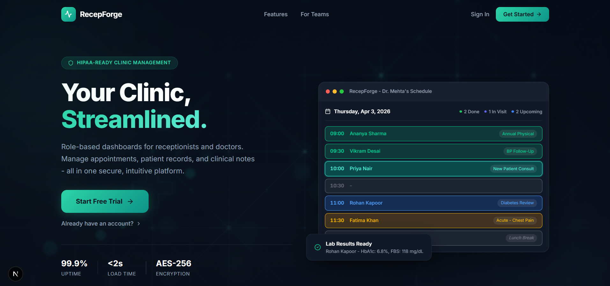
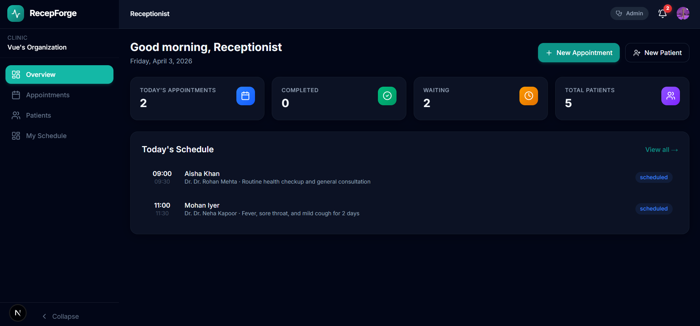
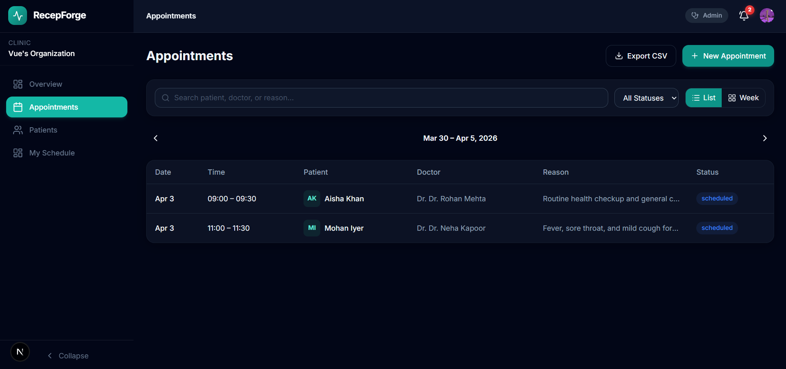
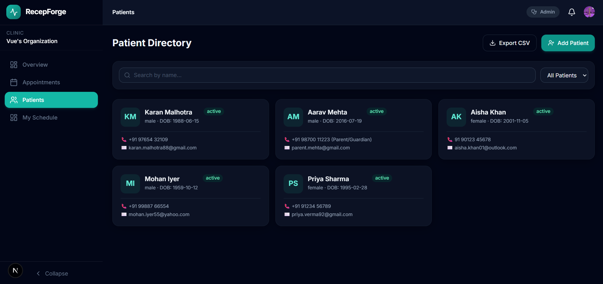
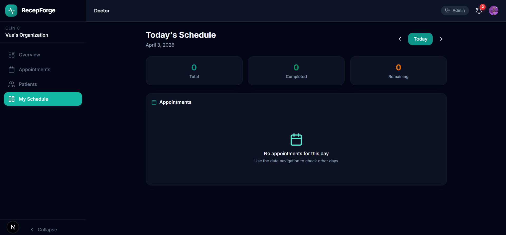

# RecepForge



RecepForge is a role-based clinic management platform designed to streamline operations for receptionists and doctors. It provides secure, separate dashboards for appointment scheduling, patient registry management, and clinical documentation.

## Core Features

- **Role-Based Access Control:** Highly secure, dedicated workspaces for Receptionists and Doctors.
- **OPD Scheduling:** One-click appointment booking with auto-conflict detection.
- **Live Appointment Queue:** Real-time status board tracking patient journeys.
- **Patient Registry:** Complete patient profiles with demographics and medical history.
- **Doctor Workspace:** SOAP-format clinical notes, one-tap visit flow, and historical records.
- **Real-Time Sync:** Instant UI updates across all devices powered by a WebSocket database.

## Tech Stack

- **Frontend:** Next.js (App Router), React 19, Tailwind CSS v4
- **Backend & Database:** Convex (Real-time Database and Serverless Functions)
- **Authentication:** Clerk Auth
- **Email Delivery:** Resend

## Application Gallery

### Receptionist Dashboard

The central hub for clinic receptionists to manage daily operations, track queue status, and access patient files.


---

### Appointments Calendar

A comprehensive calendar view for scheduling, confirming, and managing patient appointments.


---

### Patient Registry

A searchable directory of all registered patients, allowing easy access to personal details and appointment history.


---

### Doctor Workspace

A dedicated area for physicians to review patient history, write clinical notes (SOAP format), and manage their active queue.


## Setup Instructions

1. **Clone the repository:**

   ```bash
   git clone <repo_url>
   cd recepforge-webapp
   ```

2. **Install dependencies:**

   ```bash
   npm install
   ```

3. **Set up environment variables:**
   Copy the example environment file and fill in your keys:

   ```bash
   cp .env.example .env.local
   ```

   _(Make sure to add your Clerk publishable/secret keys and Convex deployment URL)_

4. **Initialize Backend:**

   ```bash
   npx convex dev
   ```

5. **Run the development server:**
   ```bash
   npm run dev
   ```
   Open [http://localhost:3000](http://localhost:3000) with your browser to see the application.
